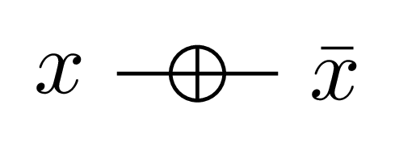

# State-of-the-art in reversible logic synthesis

## Overview

We classify reversible synthesis algorithms using 4 levels of categorization:

1. **Reversiblity of the input**: we distinguish between nonreversible and reversible functions.  Embedding is not part of this categorization and need to be applied as a preprocess if needed. Columns in the overview figure refer to this level.
2. **Manipulation of the input**: if the synthesis algorithm modifies the input during execution or emphasizes on the underlying function of the input rather than its structure, we refer to the synthesis approaches as *functional synthesis*, otherwise as *structural synthesis*.  Functional synthesis algorithms guarantee optimum lines during synthesis and may also allow optimum number of gates. Rows in the overview figure refer to this level.
3. **Algorithm**: For each category several algorithms may be proposed which differ in their conceptual methodology. Items in boxes refer to this level.
4. **Implementation**: Each algorithm can be implemented in several different ways using several different data structures for the input representation.  This level is not visible in the overview figure but discussed in the following text.

**Example**: The original transformation-based synthesis algorithm from D.M. Miller, D. Maslov and G.W. Dueck [[*DAC* **40**, 2003, 318-323.]](http://dl.acm.org/citation.cfm?doid=775832.775915) starts from a *reversible input function* (1) and it is *functional* (2).  Obviously, it falls in the category of *transformation-based synthesis* algorithms (3) and the specific works marks one of many implementations in this category (4).

## Gate libraries

### NCT (Not, CNOT, Toffoli)

| NOT                  | CNOT                   | Toffoli                      |
| -------------------- | ---------------------- | ---------------------------- |
|  |  |  |

The NCT library consists of the three gates NOT, CNOT, and Toffoli.  The Toffoli gate is a double-controlled NOT gate. These gates are universal in a sense, that every Boolean function can be realized if an arbitrary number of variables (lines) is permitted.  Given *n* variables, the NCT gate library can realize all permutations over *n* ≤ 3 variables and all even permutations over *n* > 3 variables.

## Synthesis algorithms for reversible functions

### Functional exact algorithms
Exact synthesis algorithms guarantee minimality in number of gates (time) and number of lines (space).

#### SAT-based synthesis
Given a truth table of a Boolean function *f*, the decision problem “*Does there exist a reversible circuit with k gates that represents f?*” is translated into a SAT problem. A circuit can be extracted from a satisfying assignment to the problem. Asking the question, starting from *k* being 0 and incrementing it until the problem is satisfiable, gives the gate-optimum circuit.

**Input representations:** truth table

**Gate libraries:** MCT, MPMCT

**Implementations:** [RevKit](https://github.com/msoeken/cirkit/blob/master/addons/cirkit-addon-reversible/src/reversible/synthesis/exact_synthesis.cpp) (command: `exs --mode 1`), [RevKit](https://github.com/msoeken/cirkit/blob/master/addons/cirkit-addon-reversible/src/reversible/synthesis/quantified_exact_synthesis.cpp) (command: `exs --mode 0`)

**References:**
* [D. Große, R. Wille, G.W. Dueck, and R. Drechsler: Exact multiple-control Toffoli network synthesis with SAT techniques, in: *IEEE Trans. on CAD* **28**, 2009, 703&ndash;715.](http://dx.doi.org/10.1109/TCAD.2009.2017215)  
* [R. Wille, M. Soeken, N. Przigoda, and R. Drechsler: Effect of negative control lines on the exact synthesis of reversible circuits, in: *Multiple-valued Logic and Soft Computing* **21**, 2013, 627-640.](http://www.oldcitypublishing.com/MVLSC/MVLSCabstracts/MVLSC21.5-6abstracts/MVLSCv21n5-6p627-640Wille.html)
* [R. Wille, H.M. Le, G.W. Dueck, and D. Große: Quantified Synthesis of Reversible Logic, in: *DATE*, 2008, 1015-1020.](http://dx.doi.org/10.1109/DATE.2008.4484814)

### Functional heuristic algorithms
Functional heuristic synthesis algorithms guarantee minimality in number of lines (space).

#### Transformation-based synthesis
Starting from a reversible function, transformation-based synthesis applies gates and adjusts the function representation accordingly in a way that each gate application gets the function closer to the identity function.  If the identity function has been reached, all applied gates make up for the circuit that realizes the initial function.

**Input representations:** truth table, RCBDD

**Gate libraries:** MCT, MPMCT (only negative controls), MCT+F

**Implementations:** [RevKit](https://github.com/msoeken/cirkit/blob/master/addons/cirkit-addon-reversible/src/reversible/synthesis/transformation_based_synthesis.cpp) (command: `tbs`), [RevKit](https://github.com/msoeken/cirkit/blob/master/addons/cirkit-addon-reversible/src/reversible/synthesis/symbolic_transformation_based_synthesis.cpp) (command: `tbs -b` and `tbs -s`)

**References:**
* [D.M. Miller, D. Maslov, and G.W. Dueck: A transformation based algorithm for reversible logic synthesis, in: *DAC* **40**, 2003, 318-323.](http://dl.acm.org/citation.cfm?doid=775832.775915)
* [M. Soeken, G.W. Dueck, and D.M. Miller: A fast symbolic transformation based algorithm for reversible logic synthesis, in: *RC* **8**, 2016.](http://msoeken.github.io/papers/2016_rc_1.pdf)
* [M. Soeken and A. Chattopadhyay: Fredkin-enabled transformation-based reversible logic synthesis, in: *ISMVL* **46**, 2015, 60-65.](http://ieeexplore.ieee.org/xpl/articleDetails.jsp?arnumber=7238133)

#### Decomposition-based synthesis
In decomposition-based synthesis the reversible function is iteratively decomposed into simpler functions based on the  *Young subgroup decomposition*: Given a line *i*, every reversible function *f* can be decomposed into three functions *f = g1* ○ *f'* ○ *g2*, where *g1* and *g2* can be realized with a single-target gate on line *i* and *f'* is a reversible function that does not change in line *i*. Based on this decomposition, synthesis algoriths determine the gates for *g1* and *g2* and then recur on *f'*.

**Input representations:** truth table, RCBDD

**Gate libraries:** STG

**Implementations:** [RevKit](https://github.com/msoeken/cirkit/blob/master/addons/cirkit-addon-reversible/src/reversible/synthesis/young_subgroup_synthesis.cpp) (command: `dbs`), [RevKit](https://github.com/msoeken/cirkit/blob/master/addons/cirkit-addon-reversible/src/reversible/synthesis/rcbdd_synthesis.cpp) (command: `dbs -s`)

**References:**
* [A. De Vos and Y. Van Rentergem: Young subgroups for reversible computers, in: *Adv. in Math. of Comm.* **2**, 2008, 183-200.](http://dx.doi.org/10.3934/amc.2008.2.183)
* [M. Soeken, L. Tague, G.W. Dueck, and R. Drechsler: Ancilla-free synthesis of large reversible functions using binary decision diagrams, in: *J. Symb. Comput.* **73**, 2016, 1-26.](http://dx.doi.org/10.1016/j.jsc.2015.03.002)

#### Greedy synthesis
Greedy synthesis is similar to transformation-based synthesis.  At each step it applies a set of gates to the current function to be synthesized and chooses the gate that brings the function closest to the identity function.

**Input representation:** BDD

**Gate libraries:** arbitrary

**References:**
* [P. Kerntopf: A new heuristic algorithm for reversible logic synthesis, in: *DAC* **41**, 2004, 834-837.](http://dl.acm.org/citation.cfm?id=996789)

## Synthesis algorithms for nonreversible functions

### Structural algorithms
Structural algorithms do neither guarantee optimality for number of gates nor for number of lines.

## Optimization algorithms

